# Enviro365 Waste Management API
## Homepage UI


## Dashboard UI


## Project Overview
A Spring Boot REST API for the Enviro365 waste sorting mobile application, designed to promote sustainable waste management practices and environmental consciousness.

## Table of Contents
- [Technologies Used](#technologies-used)
- [Project Structure](#project-structure)
- [System Architecture](#system-architecture)
- [Database Schema](#database-schema)
- [API Documentation](#api-documentation)
- [UI Examples](#ui-examples)
- [Testing](#testing)
- [Setup and Installation](#setup-and-installation)


## Dependencies
- Java 17
- Spring Boot 3.4.2
- Spring Data JPA
- H2 Database
- Maven
- Spring Validation
- Lombok

## Project Structure
```md
src/
├── main/
│   ├── java/
│   │   └── com/enviro/assessment/grad001/thabanglenonyana/
│   │       ├── Application.java
│   │       ├── category/
│   │       │   └── (**Waste Category Layers**)
│   │       ├── guideline/
│   │       │   └── (**Disposal Guidline Layers**)
│   │       ├── tip/
│   │       │   └── (**Recycling Tip Layers**)
+           ├── config/
+           │   ├── EnvConfig.java           (Production profile configuration)
+           │   ├── OpenAPIConfig.java       (API documentation configuration)
+           │   ├── ProfileConfig.java       (Profile verification)
+           │   └── WebConfig.java           (CORS and resource handling)
+           ├── image_analysis/
+           │   ├── ImageAnalysisRequest.java
+           │   ├── ImageAnalysisResponse.java
+           │   ├── ImageRecognitionController.java
+           │   ├── ImageRecognitionService.java
+           │   ├── MaterialMappingService.java
+           │   └── RecognizedMaterial.java
+           ├── util/
+           │   ├── ApplicationStartupLogger.java
+           │   ├── AzureConfig.java
+           │   └── DatabaseInfoLogger.java
│   │       └── exception/
│   │           └── (Custom exceptions)java           
```

## System Architecture
The system follows a layered architecture pattern with clear separation of concerns:



### Layers
| Layer                   | Component                  | Description                                                                                   |
|-------------------------|----------------------------|-----------------------------------------------------------------------------------------------|
| **API/Controller Layer**| WasteCategoryController    | Handles HTTP requests related to waste categories, providing endpoints for CRUD operations    |
|                         | DisposalGuidelineController| Manages endpoints for disposal guidelines, processing user requests for proper waste disposal instructions |
|                         | RecyclingTipController     | Controls endpoints for recycling tips, serving information about best recycling practices      |
| **Service Layer**       | WasteCategoryService       | Implements business logic for waste categorization, including validation and processing of waste category data |
|                         | DisposalGuidelineService   | Contains business rules and processing logic for disposal guidelines, ensuring proper waste disposal methods |
|                         | RecyclingTipService        | Manages business logic for recycling tips, including filtering and organizing recycling recommendations |
| **Repository Layer**    | WasteCategoryRepository    | Handles database operations for waste categories, providing data access and persistence        |
|                         | DisposalGuidelineRepository| Manages database interactions for disposal guidelines, storing and retrieving disposal instructions |
|                         | RecyclingTipRepository     | Handles database operations for recycling tips, maintaining the recycling information database  |
| **Additional Components**| API Clients               | External applications or users that interact with the system through the API endpoints         |
|                         | Waste Management DB        | Central database storing all waste management related data, including categories, guidelines, and recycling tips |


## Class Diagram



- **Core Domain Entities and Relationships**: The diagram clearly shows how WasteCategory, DisposalGuideline, and RecyclingTip entities interact within the system, forming the foundation of our waste management domain.

- **Attributes and Methods**: Each class is detailed with its essential properties (like id, name, description) and behaviors (methods), providing a complete view of the data structure and available operations.

- **Relationship Mapping**: Demonstrates how one WasteCategory can have multiple DisposalGuidelines and RecyclingTips, reflecting the real-world relationship between waste types and their management instructions.

- **Data Model Structure**: Provides developers with a clear blueprint of how data is organized and accessed within the application, facilitating better understanding of the system's data flow.


## API Documentation
RESTful API for the Enviro365 waste management application. The API provides endpoints for managing waste categories, disposal guidelines, recycling tips, and recycling facilities. All endpoints are prefixed with `/api`.

Interactive API documentation is available at:
- Swagger UI: http://localhost:8080/swagger-ui.html
- OpenAPI JSON: http://localhost:8080/v3/api-docs

### Waste Categories
| Method | Endpoint | Description | Request Body | Response Body | Status Codes |
|--------|----------|-------------|--------------|---------------|--------------|
| GET | `/categories` | List all categories | N/A | [response](/docs/api/categories/list-response.json) | 200, 404 |
| POST | `/categories` | Create new category | [request](/docs/api/categories/create-request.json) | [response](/docs/api/categories/create-response.json) | 201, 400, 409 |
| GET | `/categories/{id}` | Get category by ID | N/A | [response](/docs/api/categories/get-response.json) | 200, 404 |
| PUT | `/categories/{id}` | Update category | [request](/docs/api/categories/update-request.json) | [response](/docs/api/categories/update-response.json) | 200, 400, 404 |
| DELETE | `/categories/{id}` | Delete category | N/A | N/A | 204, 404 |

### Disposal Guidelines
| Method | Endpoint | Description | Request Body | Response Body | Status Codes |
|--------|----------|-------------|--------------|---------------|--------------|
| GET | `/guidelines` | List all guidelines | N/A | [response](/docs/api/guidelines/list-response.json) | 200 |
| GET | `/guidelines/{id}` | Get guideline by ID | N/A | [response](/docs/api/guidelines/get-response.json) | 200, 404 |
| PUT | `/guidelines/{id}` | Update guideline | [request](/docs/api/guidelines/update-request.json) | [response](/docs/api/guidelines/update-response.json) | 200, 400, 404 |
| DELETE | `/guidelines/{id}` | Delete guideline | N/A | N/A | 204, 404 |
| PATCH | `/guidelines/{guidelineId}/assign/{categoryId}` | Assign guideline to category | N/A | [response](/docs/api/guidelines/assign-response.json) | 200, 400, 404 |
| PATCH | `/guidelines/{guidelineId}/unassign` | Remove category assignment | N/A | [response](/docs/api/guidelines/unassign-response.json) | 200, 404 |

### Recycling Tips
| Method | Endpoint | Description | Request Body | Response Body | Status Codes |
|--------|----------|-------------|--------------|---------------|--------------|
| GET | `/tips` | List all tips | N/A  | [response](/docs/api/tips/list-response.json) | 200, 404 |
| POST | `/tips` | Create new tip | [request](/docs/api/tips/create-request.json) | [response](/docs/api/tips/create-response.json) | 201, 400, 409 |
| GET | `/tips/{id}` | Get tip by ID | N/A  | [response](/docs/api/tips/get-response.json) | 200, 404 |
| PUT | `/tips/{id}` | Update tip | [request](/docs/api/tips/update-request.json) | [response](/docs/api/tips/update-response.json) | 200, 404, 400 |
| DELETE | `/tips/{id}` | Delete tip | N/A  | N/A  | 204, 404 |
| PATCH | `/tips/{tipId}/assign/{categoryId}` | Assign tip to category | N/A | [response](/docs/api/tips/assign-response.json) | 200, 400, 404 |
| PATCH | `/tips/{tipId}/unassign` | Remove category assignment | N/A | [response](/docs/api/tips/unassign-response.json) | 200, 404 |

### Recycling Locations/Facilities
| Method | Endpoint | Description | Request Body | Response Body | Status Codes |
|--------|----------|-------------|--------------|---------------|--------------|
| GET | `/locations` | Get all locations with pagination | N/A | Page of RecyclingLocationDTO | 200 |
| GET | `/locations/{id}` | Get location by ID | N/A | RecyclingLocationDTO | 200, 404 |
| GET | `/locations/map-data` | Get all locations for map display | N/A | List of RecyclingLocationDTO | 200 |
| GET | `/locations/by-type/{type}` | Get locations by facility type | N/A | List of RecyclingLocationDTO | 200 |
| GET | `/locations/nearby` | Find nearby locations | N/A | List of RecyclingLocationDTO | 200 |
| GET | `/locations/by-materials` | Find locations by accepted materials | N/A | List of RecyclingLocationDTO | 200 |

### Filter Options 
| Method | Endpoint | Description | Request Body | Response Body | Status Codes |
|--------|----------|-------------|--------------|---------------|--------------|
| GET | `/locations/filter-options` | Get all filter options | N/A | Map with cities, facility types, and materials | 200 |
| GET | `/locations/filter-options/cities` | Get distinct cities | N/A | List of city options | 200 |
| GET | `/locations/filter-options/facility-types` | Get distinct facility types | N/A | List of facility type options | 200 |
| GET | `/locations/filter-options/materials` | Get distinct materials | N/A | List of material options | 200 |

## API Error Handling

The waste management API implements comprehensive error handling for all endpoints:

| Status Code | Description | Example Scenarios |
|-------------|-------------|-------------------|
| 200 OK | Request successful | Get resource, Update resource |
| 201 CREATED | Resource created | Create new resource |
| 204 NO_CONTENT | Resource deleted | Delete operations |
| 400 BAD_REQUEST | Invalid input/validation error | Empty title, Invalid format, Illegal assignment |
| 404 NOT_FOUND | Resource not found | Invalid ID |
| 409 CONFLICT | Resource conflict | Duplicate title |
| 500 SERVER_ERROR | Server error | Unexpected errors |

### Exception Handling Examples
- [`ResourceNotFoundException`](src/main/java/com/enviro/assessment/grad001/thabanglenonyana/waste_management/exception/ResourceNotFoundException.java): When requested resource is not found
- [`ConstraintViolationException`](jakarta.validation.ConstraintViolationException): For validation failures
- General runtime exceptions: Mapped to INTERNAL_SERVER_ERROR

### API Request Sequence Diagram


# Image Recognition and Material Identification

The Enviro365 application provides image-based waste material identification to help users properly sort and recycle their waste. This feature uses Azure AI Vision services to analyze images and identify recyclable materials.

## How It Works

1. User uploads an image of waste material through the mobile app
2. The system analyzes the image using Azure AI Vision services
3. The system identifies the material type (plastic, paper, glass, etc.)
4. Based on the identified material and user location, the system provides:
   - Material classification and recyclability status
   - Nearby recycling facilities that accept this material
   - Proper disposal guidelines
   - Recycling tips

## API Endpoint

**POST /api/image-recognition/analyze**

This endpoint accepts multipart form data with the following parameters:

| Parameter | Type | Required | Description |
|-----------|------|----------|-------------|
| file | File | Yes | The image file to analyze |
| latitude | Double | No | User's latitude for finding nearby facilities |
| longitude | Double | No | User's longitude for finding nearby facilities |
| radius | Integer | No | Search radius in km (default: 10) |

### Response Format

```json
{
  "material": {
    "materialType": "plastic",
    "detectedObjects": ["bottle", "plastic"],
    "confidenceScore": 0.85,
    "recyclingInstructions": "Rinse and place in recycling bin",
    "recyclable": true,
    "wasteCategoryId": 1
  },
  "nearbyLocations": [
    {
      "id": 1,
      "name": "Recycling Center",
      "latitude": 34.0500,
      "longitude": -118.2400,
      "type": "Recycling Center",
      "acceptedMaterials": {
        "plastic": true,
        "paper": false,
        "glass": true
      }
    }
  ],
  "disposalGuidelines": [
    {
      "id": 1,
      "instructions": "Rinse and place in recycling bin"
    }
  ],
  "recyclingTips": [
    {
      "id": 1,
      "steps": ["Remove caps before recycling"]
    }
  ]
}
```

## Frontend Architecture

The EcoTrack frontend is built with Angular, using a modern component-based architecture for better maintainability and reusability. The application leverages Angular's standalone component capabilities for better tree-shaking and modularization.

### Key Frontend Features

1. **Interactive Recycling Facility Map:**
   - Google Maps integration with custom clustering
   - Facility filtering by type, materials, and location
   - Proximity-based search for nearby recycling facilities
   - Responsive visualization of facility statistics

2. **Dashboard Interface:**
   - Management of waste categories
   - Disposal guideline administration
   - Recycling tips organization

3. **Home Experience:**
   - Educational content about waste management
   - Quick access to categories and guidelines
   - Responsive design for mobile and desktop users

### Main Frontend Components

| Component | Description | Functionality |
|-----------|-------------|---------------|
| **MapComponent** | Container for map view | Coordinates facility selection, filtering, and information display |
| **FacilityMapComponent** | Renders interactive map | Handles Google Maps integration, marker display, and user interactions |
| **MapControlsComponent** | User controls for map | Provides filtering, sorting, and proximity search capabilities |
| **MapInfoWindowComponent** | Statistics display | Shows aggregated data about visible facilities |
| **HeaderNavComponent** | Navigation header | Provides app-wide navigation and context |
| **DashboardComponent** | Admin dashboard | Container for waste management administration tools |
| **CategoryGridComponent** | Category display | Shows waste categories in grid layout with interaction capabilities |

### Frontend Models

| Model | Description | Properties |
|-------|-------------|------------|
| **RecyclingFacility** | Represents a recycling location | id, name, latitude, longitude, type, acceptedMaterials |
| **WasteCategory** | Represents a waste category | id, name, description, guidelines, tips |
| **DisposalGuideline** | Represents disposal instructions | id, title, description, instructions |
| **RecyclingTip** | Represents recycling advice | id, title, content, category |

### Frontend Services

| Service | Description | Key Methods |
|---------|-------------|------------|
| **FacilityService** | Handles API calls for facilities | getAllFacilities(), getNearbyFacilities(), getFacilitiesByType() |
| **MapClusteringService** | Manages map clustering logic | applyClusteringToFacilities(), handleZoomChange() |
| **GeographicContextService** | Maintains geographic context | updateContext(), goToProvince(), goToCity() |

## UI Examples


## Testing

### Unit Tests Coverage
The application includes comprehensive unit tests covering:

#### WasteCategory Operations
- CRUD operations (Create, Read, Update, Delete)
- Input validation
- Error scenarios
- Service exceptions

#### Test Categories
1. **Success Scenarios**
   - Get all categories
   - Get category by ID
   - Create category
   - Update existing category
   - Delete category

2. **Validation Tests**
   - Empty category name
   - Null description
   - Invalid data format

3. **Error Handling**
   - Non-existing category
   - Database errors
   - Constraint violations

4. **Edge Cases**
   - Empty list handling
   - Service exceptions
   - Update conflicts

## Setup and Installation
### 1. Prerequisites
   - Java 17 or higher
   - Maven
   - Your favorite IDE (IntelliJ IDEA recommended)

### 2. Clone the repository.
```bash
    git clone [repository-url]
```

### 3. configure application properties.
```bash
spring.h2.console.enabled=true
spring.datasource.url=jdbc:h2:mem:wastesortdb
```

### 4. Build and run the application.
```bash
./mvnw build
./mvnw spring-boot:run

